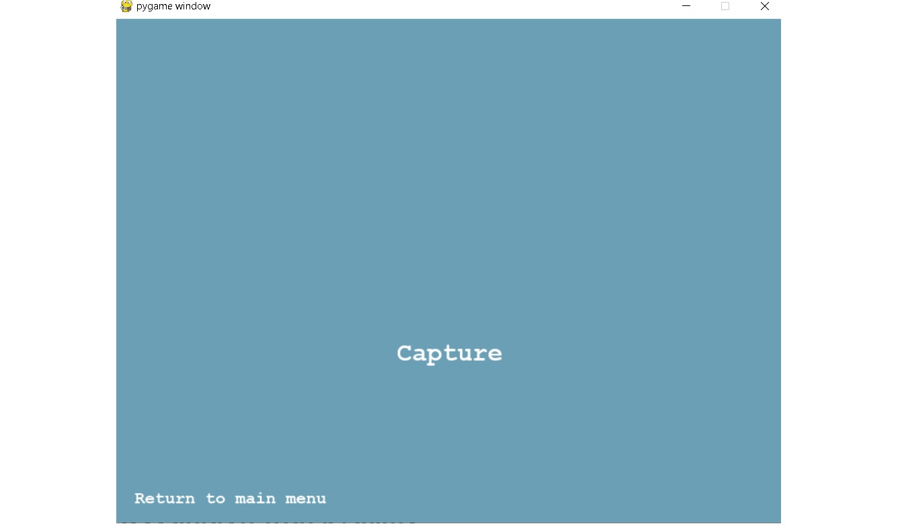
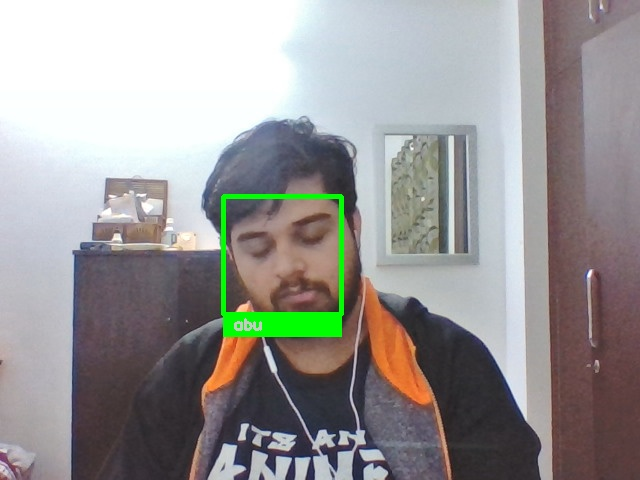
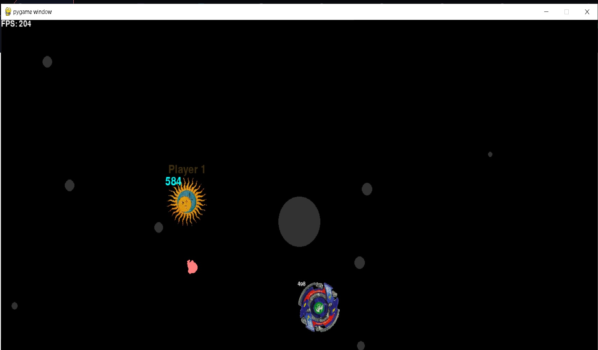

# python-assignment

fork this repo and start your work 

<h1 align="center">Facial Recognition with pygame</h1>
 <h5 align = "left">Using face_recognition library to recognize the face of the person infornt of the camera and using Pygame for the Graphical User Interface(GUI) of the following, also has a beyblade game if the user is bored.
</h5>

### How it works
```sh
This facial recognition program uses multiple library and modules, unlike our usual OpenCV and Tensorflow/Pytorch model we are using a pre exisitng solution i.e. 
```
[face_recognition](https://github.com/ageitgey/face_recognition) 
```
which recognizes and manipulates faces from Python or from the command line with the world's simplest face recognition library.
```
#### Homepage
```sh
   The homepage of the GUI, click the "Recognize" button to start recognizing 
   Press the "Bored?" button to play the game.
 ```
 </a>
</div>

#### Capture Page
```sh
   Press the "Capture" button to take a photo of the person in front of the camera which shall then be analyzed
 ```
 </a>
</div>

#### Recognized Face
```sh
   The face once recognised shall be displayed as shown: 
   PS: Don't expect a DP worthy pic to be taken xD
 ```
 </a>
</div>

#### Beyblade Game
```sh
   Recognizing faces could be boring....take a break!
 ```
 </a>
</div>
